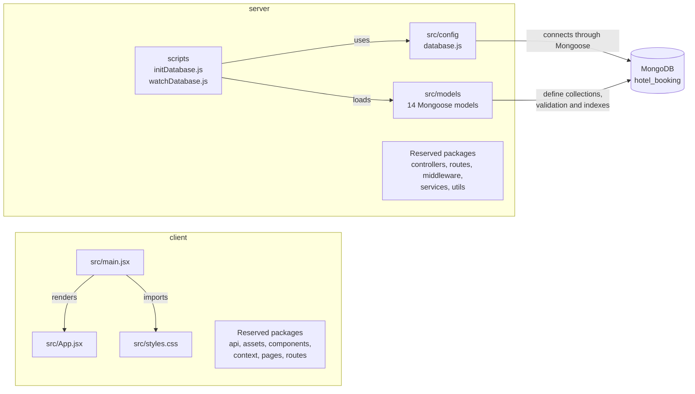
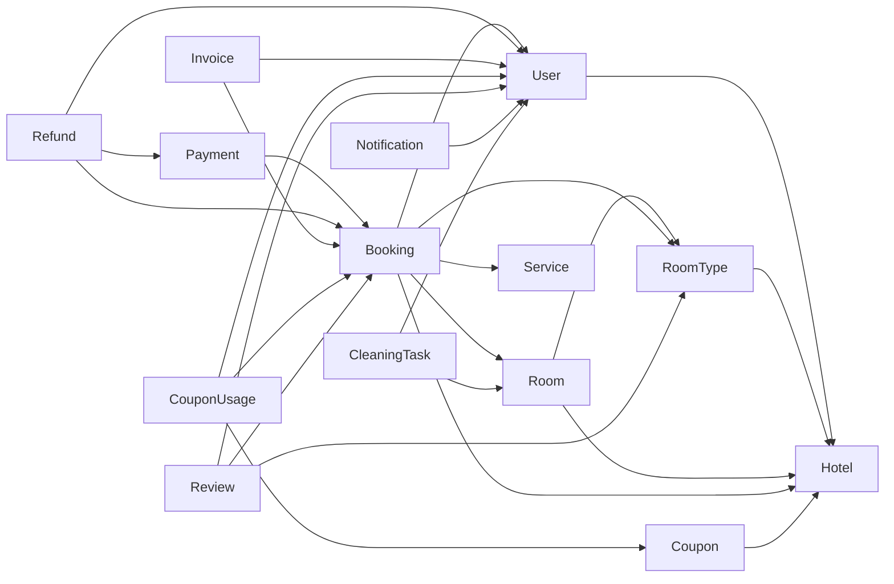
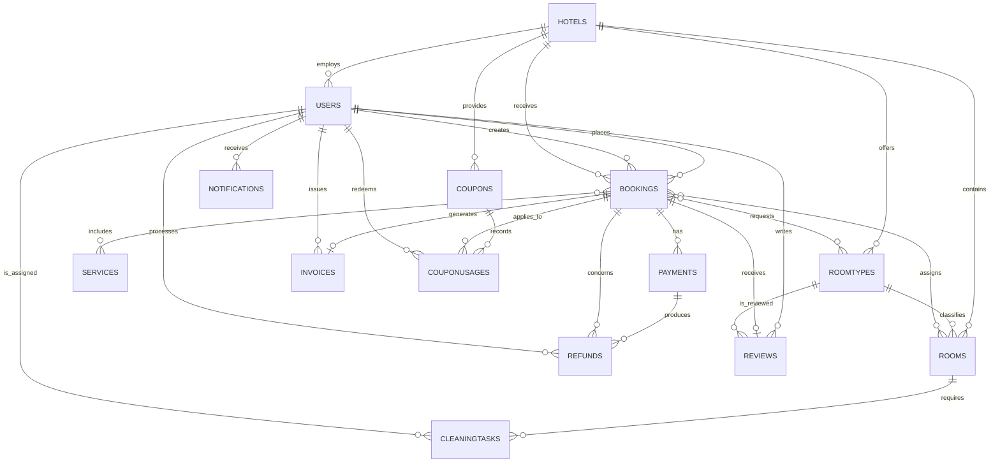

# I. Overview

> This document describes the original 14-model baseline. The current 17-model
> design is in `use-case-collection-design.md`; models are imported directly
> from their files and no longer use `models/index.js`.

## 1. Code Packages

### 1.1 Overall package structure

The Hotel Booking System follows a client-server architecture. The client is a
React single-page application built with Vite. The server currently contains the
MongoDB connection, database scripts, and Mongoose data models. Folders for the
server's routes, controllers, middleware, services, and utilities have been
created as extension points, but they do not contain implementation yet.

> The database scripts import the configuration and model packages directly.
> Individual model files import `mongoose`; they do not import `database.js`.

### 1.2 Data-model package dependencies

The following diagram shows logical dependencies created by Mongoose `ref`
fields. An arrow from collection A to collection B means that A stores an
`ObjectId` that refers to a document in B.

### 1.3 Package descriptions

| No. | Package | Description |
|---:|---|---|
| 01 | `client/src` | Frontend application package. It contains the React entry point, root component, and global styling. |
| 02 | `client/src/api` | Reserved for functions that call the server API. No implementation is currently present. |
| 03 | `client/src/assets` | Reserved for frontend images, icons, fonts, and other static source assets. |
| 04 | `client/src/components` | Reserved for reusable React UI components. No implementation is currently present. |
| 05 | `client/src/context` | Reserved for shared React context and application-level client state. No implementation is currently present. |
| 06 | `client/src/pages` | Reserved for page-level React components. No implementation is currently present. |
| 07 | `client/src/routes` | Reserved for frontend navigation and route declarations. No implementation is currently present. |
| 08 | `server/scripts` | Contains executable database utilities. `initDatabase.js` creates all collections and synchronizes indexes; `watchDatabase.js` keeps a development database connection open. |
| 09 | `server/src/config` | Contains infrastructure configuration. `database.js` validates `MONGO_URI` and opens the Mongoose connection. |
| 10 | `server/src/models` | Implements the persistence model with 14 Mongoose schemas, including field validation, references, timestamps, and indexes. `index.js` exports all models from one entry point. |
| 11 | `server/src/controllers` | Reserved for request handlers that coordinate application operations. No implementation is currently present. |
| 12 | `server/src/routes` | Reserved for server endpoint definitions and controller mapping. No implementation is currently present. |
| 13 | `server/src/middleware` | Reserved for shared request-processing concerns such as authentication, authorization, validation, and error handling. No implementation is currently present. |
| 14 | `server/src/services` | Reserved for reusable business logic and integrations. No implementation is currently present. |
| 15 | `server/src/utils` | Reserved for general-purpose server helper functions. No implementation is currently present. |

### 1.4 Naming conventions

- Folder and package names use lowercase words, for example `models`, `config`,
  and `components`.
- React component and Mongoose model filenames use PascalCase, for example
  `App.jsx`, `Booking.js`, and `RoomType.js`.
- JavaScript variables and functions use camelCase, for example
  `connectDatabase`, `bookingRoomSchema`, and `checkInDate`.
- Constants and enum values stored in MongoDB use lowercase snake_case where
  more than one word is required, for example `checked_in`, `front_desk`, and
  `bank_transfer`.
- MongoDB references use the suffix `Id`, for example `hotelId`, `bookingId`,
  and `customerId`.
- Mongoose automatically maps model names to lowercase plural collection names;
  for example, `User` is stored in `users` and `RoomType` in `roomtypes`.

# II. Database Design

## 1. Database schema

The application uses the MongoDB database `hotel_booking` through Mongoose. It
contains 14 collections. MongoDB does not enforce foreign keys at database
level; relationships are represented by `ObjectId` fields with Mongoose `ref`
metadata. Embedded booking-room, booking-service, seasonal-pricing, customer-
profile, and employee-profile objects are stored inside their owning documents.

### 1.1 Collection relationship diagram

Some references are optional. Specifically, `users.employeeProfile.hotelId`,
`bookings.rooms.roomId`, `bookings.services.serviceId`, `refunds.processedBy`,
`invoices.issuedBy`, `coupons.hotelId`, and `cleaningtasks.assignedTo` may be
absent. The diagram expresses the business relationship, while the detailed
tables below state which individual fields are required.

### 1.2 Collection summary

| No. | Collection | Mongoose model | Purpose |
|---:|---|---|---|
| 01 | `users` | `User` | Stores customer and employee accounts, roles, status, and profile data. |
| 02 | `hotels` | `Hotel` | Stores hotel identity, location, rating, and contact information. |
| 03 | `roomtypes` | `RoomType` | Stores room categories, capacity, amenities, images, base price, and seasonal prices. |
| 04 | `rooms` | `Room` | Stores physical hotel rooms and their current operating status. |
| 05 | `services` | `Service` | Stores optional chargeable services available to bookings. |
| 06 | `bookings` | `Booking` | Stores reservations, reserved rooms, services, stay dates, discount, total, source, and status. |
| 07 | `payments` | `Payment` | Stores booking payment attempts and their transaction details. |
| 08 | `refunds` | `Refund` | Stores refund requests and processing status for payments and bookings. |
| 09 | `invoices` | `Invoice` | Stores the single invoice that may be issued for a booking. |
| 10 | `coupons` | `Coupon` | Stores hotel promotions, validity periods, discount rules, and usage limits. |
| 11 | `couponusages` | `CouponUsage` | Records when a customer applies a coupon to a booking. |
| 12 | `reviews` | `Review` | Stores a customer's rating and comment for a booked room type. |
| 13 | `notifications` | `Notification` | Stores account notifications and their read state. |
| 14 | `cleaningtasks` | `CleaningTask` | Stores room-cleaning assignments, schedule, status, and completion time. |

### 1.3 Detailed collection schemas

All `_id` values are MongoDB `ObjectId` values generated automatically.
Collections whose schema enables Mongoose timestamps also receive `createdAt`
and `updatedAt` automatically.

#### `users`

| Field | Type | Required | Constraint / relationship |
|---|---|:---:|---|
| `_id` | ObjectId | Yes | Primary document identifier |
| `username` | String | Yes | Unique; trimmed |
| `email` | String | Yes | Unique; lowercase; trimmed |
| `passwordHash` | String | Yes | Stores the password hash, not a plain-text password |
| `role` | String | Yes | `customer`, `receptionist`, `manager`, `housekeeping`, or `admin`; default `customer` |
| `phone` | String | No | Telephone number |
| `status` | String | No | `active`, `suspended`, or `deleted`; default `active` |
| `lastLogin` | Date | No | Most recent login time |
| `customerProfile` | Embedded object | No | Contains `fullName`, `address`, `dateOfBirth`, `loyaltyPoints`, and `idDocumentNo` |
| `employeeProfile` | Embedded object | No | Contains `hotelId` → `hotels`, `position`, `hireDate`, and `shift` |
| `createdAt`, `updatedAt` | Date | Yes | Generated by Mongoose timestamps |

#### `hotels`

| Field | Type | Required | Constraint / relationship |
|---|---|:---:|---|
| `_id` | ObjectId | Yes | Primary document identifier |
| `name` | String | Yes | Hotel name |
| `address` | String | No | Street address |
| `city` | String | No | Indexed |
| `starRating` | Number | No | From 1 to 5 |
| `phone` | String | No | Contact telephone number |
| `email` | String | No | Contact email address |
| `createdAt`, `updatedAt` | Date | Yes | Generated by Mongoose timestamps |

#### `roomtypes`

| Field | Type | Required | Constraint / relationship |
|---|---|:---:|---|
| `_id` | ObjectId | Yes | Primary document identifier |
| `hotelId` | ObjectId | Yes | Indexed reference → `hotels._id` |
| `name` | String | Yes | Room-type name |
| `description` | String | No | Room-type description |
| `basePrice` | Number | Yes | Minimum 0 |
| `maxOccupancy` | Number | No | Minimum 1 |
| `amenities` | String array | No | Included amenities |
| `images` | String array | No | Image paths or URLs |
| `seasonalPricing` | Embedded object array | No | Each item contains `startDate`, `endDate`, `price` (minimum 0), and `seasonName` |
| `createdAt`, `updatedAt` | Date | Yes | Generated by Mongoose timestamps |

#### `rooms`

| Field | Type | Required | Constraint / relationship |
|---|---|:---:|---|
| `_id` | ObjectId | Yes | Primary document identifier |
| `hotelId` | ObjectId | Yes | Reference → `hotels._id` |
| `roomTypeId` | ObjectId | Yes | Reference → `roomtypes._id` |
| `roomNumber` | String | Yes | Unique together with `hotelId` |
| `floor` | Number | No | Hotel floor |
| `status` | String | No | `available`, `occupied`, `maintenance`, or `cleaning`; default `available` |
| `createdAt`, `updatedAt` | Date | Yes | Generated by Mongoose timestamps |

#### `services`

| Field | Type | Required | Constraint / relationship |
|---|---|:---:|---|
| `_id` | ObjectId | Yes | Primary document identifier |
| `name` | String | Yes | Service name |
| `unitPrice` | Number | Yes | Minimum 0 |
| `createdAt`, `updatedAt` | Date | Yes | Generated by Mongoose timestamps |

#### `bookings`

| Field | Type | Required | Constraint / relationship |
|---|---|:---:|---|
| `_id` | ObjectId | Yes | Primary document identifier |
| `customerId` | ObjectId | Yes | Indexed reference → `users._id` |
| `hotelId` | ObjectId | Yes | Reference → `hotels._id` |
| `createdBy` | ObjectId | Yes | Reference → `users._id`; supports online and front-desk creation |
| `checkInDate` | Date | Yes | Planned check-in date |
| `checkOutDate` | Date | Yes | Planned check-out date |
| `status` | String | No | `pending`, `confirmed`, `checked_in`, `checked_out`, or `cancelled`; default `pending`; indexed |
| `rooms` | Embedded object array | Yes | At least one item; each has optional `roomId` → `rooms`, required `roomTypeId` → `roomtypes`, required `priceAtBooking` ≥ 0, and `guestCount` ≥ 1 |
| `services` | Embedded object array | No | Each item has optional `serviceId` → `services`, snapshot `name`, `quantity` ≥ 1, and `amount` ≥ 0 |
| `couponCode` | String | No | Snapshot of the applied coupon code |
| `discountAmount` | Number | No | Minimum 0; default 0 |
| `totalAmount` | Number | Yes | Minimum 0 |
| `bookingSource` | String | No | `online` or `front_desk`; default `online` |
| `createdAt`, `updatedAt` | Date | Yes | Generated by Mongoose timestamps |

#### `payments`

| Field | Type | Required | Constraint / relationship |
|---|---|:---:|---|
| `_id` | ObjectId | Yes | Primary document identifier |
| `bookingId` | ObjectId | Yes | Indexed reference → `bookings._id` |
| `amount` | Number | Yes | Minimum 0 |
| `method` | String | Yes | `credit_card`, `e_wallet`, `bank_transfer`, or `cash` |
| `status` | String | No | `pending`, `success`, or `failed`; default `pending` |
| `transactionRef` | String | No | External or internal transaction reference |
| `paidAt` | Date | No | Successful payment time |
| `createdAt`, `updatedAt` | Date | Yes | Generated by Mongoose timestamps |

#### `refunds`

| Field | Type | Required | Constraint / relationship |
|---|---|:---:|---|
| `_id` | ObjectId | Yes | Primary document identifier |
| `paymentId` | ObjectId | Yes | Reference → `payments._id` |
| `bookingId` | ObjectId | Yes | Reference → `bookings._id` |
| `amount` | Number | Yes | Minimum 0 |
| `reason` | String | No | Refund explanation |
| `status` | String | No | `requested`, `approved`, `completed`, or `rejected`; default `requested` |
| `processedBy` | ObjectId | No | Reference → `users._id` |
| `processedAt` | Date | No | Processing time |
| `createdAt`, `updatedAt` | Date | Yes | Generated by Mongoose timestamps |

#### `invoices`

| Field | Type | Required | Constraint / relationship |
|---|---|:---:|---|
| `_id` | ObjectId | Yes | Primary document identifier |
| `bookingId` | ObjectId | Yes | Unique reference → `bookings._id` |
| `issuedBy` | ObjectId | No | Reference → `users._id` |
| `totalAmount` | Number | No | Invoice total |
| `tax` | Number | No | Invoice tax amount |
| `issuedAt` | Date | No | Issue time |
| `createdAt`, `updatedAt` | Date | Yes | Generated by Mongoose timestamps |

#### `coupons`

| Field | Type | Required | Constraint / relationship |
|---|---|:---:|---|
| `_id` | ObjectId | Yes | Primary document identifier |
| `hotelId` | ObjectId | No | Reference → `hotels._id` |
| `code` | String | Yes | Unique; uppercase; trimmed |
| `discountType` | String | Yes | `percentage` or `fixed_amount` |
| `discountValue` | Number | Yes | Minimum 0 |
| `startDate` | Date | No | Validity start |
| `endDate` | Date | No | Validity end |
| `usageLimit` | Number | No | Minimum 1 |
| `usageCount` | Number | No | Default 0 |
| `createdAt`, `updatedAt` | Date | Yes | Generated by Mongoose timestamps |

#### `couponusages`

| Field | Type | Required | Constraint / relationship |
|---|---|:---:|---|
| `_id` | ObjectId | Yes | Primary document identifier |
| `couponId` | ObjectId | Yes | Reference → `coupons._id` |
| `bookingId` | ObjectId | Yes | Reference → `bookings._id` |
| `customerId` | ObjectId | Yes | Reference → `users._id` |
| `usedAt` | Date | No | Defaults to the current time |

The pair (`couponId`, `customerId`) is unique, so the same customer cannot use
the same coupon more than once.

#### `reviews`

| Field | Type | Required | Constraint / relationship |
|---|---|:---:|---|
| `_id` | ObjectId | Yes | Primary document identifier |
| `customerId` | ObjectId | Yes | Reference → `users._id` |
| `bookingId` | ObjectId | Yes | Unique reference → `bookings._id` |
| `roomTypeId` | ObjectId | Yes | Indexed reference → `roomtypes._id` |
| `rating` | Number | Yes | From 1 to 5 |
| `comment` | String | No | Review text |
| `status` | String | No | `pending`, `approved`, or `rejected`; default `pending` |
| `createdAt`, `updatedAt` | Date | Yes | Generated by Mongoose timestamps |

#### `notifications`

| Field | Type | Required | Constraint / relationship |
|---|---|:---:|---|
| `_id` | ObjectId | Yes | Primary document identifier |
| `accountId` | ObjectId | Yes | Indexed reference → `users._id` |
| `type` | String | No | Notification category |
| `message` | String | No | Notification content |
| `isRead` | Boolean | No | Default `false` |
| `createdAt`, `updatedAt` | Date | Yes | Generated by Mongoose timestamps |

#### `cleaningtasks`

| Field | Type | Required | Constraint / relationship |
|---|---|:---:|---|
| `_id` | ObjectId | Yes | Primary document identifier |
| `roomId` | ObjectId | Yes | Reference → `rooms._id` |
| `assignedTo` | ObjectId | No | Reference → `users._id` |
| `status` | String | No | `pending`, `in_progress`, or `done`; default `pending` |
| `scheduledDate` | Date | No | Planned cleaning date |
| `completedAt` | Date | No | Completion time |
| `createdAt`, `updatedAt` | Date | Yes | Generated by Mongoose timestamps |

### 1.4 Implemented indexes and integrity rules

| Collection | Index / validation | Purpose |
|---|---|---|
| `users` | Unique `username` | Prevents duplicate login names. |
| `users` | Unique `email` | Prevents duplicate email accounts. |
| `hotels` | Index on `city` | Supports hotel lookup by city. |
| `roomtypes` | Index on `hotelId` | Supports listing room types for a hotel. |
| `rooms` | Unique compound index on (`hotelId`, `roomNumber`) | Prevents duplicate room numbers inside the same hotel. |
| `bookings` | Index on `customerId` | Supports customer booking history. |
| `bookings` | Index on `status` | Supports operational booking queues. |
| `bookings` | Compound index on (`hotelId`, `checkInDate`, `checkOutDate`) | Supports availability searches by hotel and stay period. |
| `payments` | Index on `bookingId` | Supports retrieving payments for a booking. |
| `invoices` | Unique `bookingId` | Limits each booking to one invoice. |
| `coupons` | Unique `code` | Prevents duplicate coupon codes. |
| `couponusages` | Unique compound index on (`couponId`, `customerId`) | Prevents repeated use of a coupon by the same customer. |
| `reviews` | Unique `bookingId` | Limits each booking to one review. |
| `reviews` | Index on `roomTypeId` | Supports listing reviews for a room type. |
| `notifications` | Index on `accountId` | Supports retrieving an account's notifications. |

## 2. Design notes and current limitations

- The schema is implemented in MongoDB/Mongoose, not MySQL. The report should
  therefore call these structures **collections and documents**, rather than
  tables and rows.
- Mongoose `ref` values help application code populate related documents, but
  MongoDB does not enforce referential integrity. Deleting a referenced document
  can leave orphaned `ObjectId` values unless the future service layer handles
  cleanup.
- `checkOutDate > checkInDate`, coupon date validity, percentage values not
  exceeding 100, and refund totals not exceeding paid totals are not currently
  enforced by the schemas. These rules should be added to schema validation or
  the future service layer.
- `Service` is global because it has no `hotelId`. Add a hotel reference if each
  hotel needs its own service catalog.
- The current project is a foundation rather than a complete application: it
  does not yet expose server API routes or implement authentication and business
  workflows.
